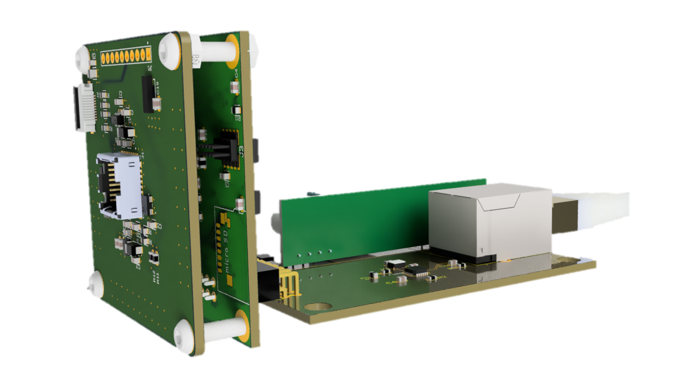

# Microchip-Solution-for-Lepton
The project provides several solutions for FLIR Lepton based on Microchip's MCUs/MPUs.

## Cat-Eye:

 The smallest solution based on Microchip SAMD51G18A.

## Genius54

## PoE

The PoE Module is optional. 

## SAMA5D2

